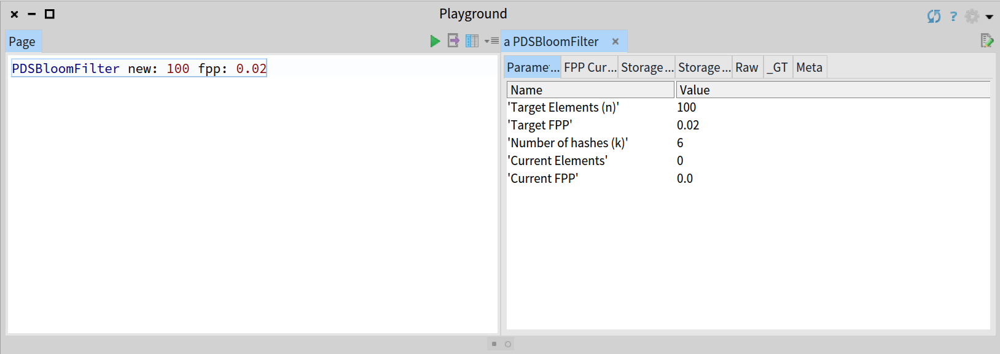
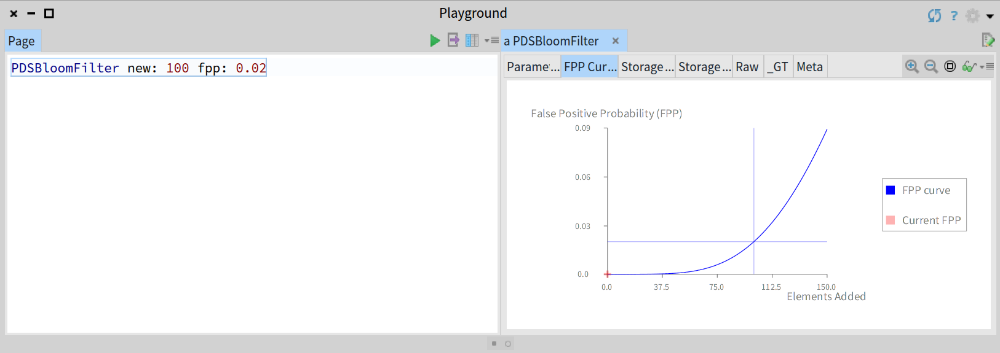
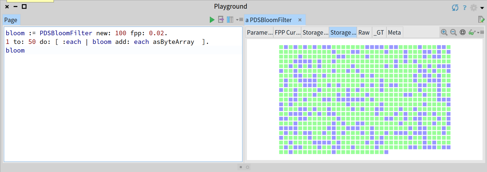
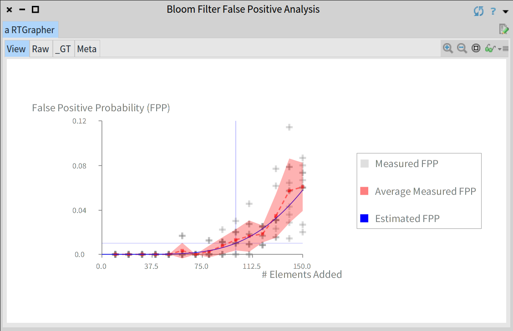

# PharoPDS

The purpose of PharoPDS is to provide some **probabilistic data structures and algorithms** implemented in Pharo.

''Probabilistic data structures'' is a common name for data structures based mostly on different hashing techniques. Unlike regular and deterministic data structures, they always provide approximated answers but with reliable ways to estimate possible errors.

The potential losses and errors are fully compensated for by extremely low memory requirements, constant query time, and scaling. All these factors make these structures relevant in ''Big Data'' applications.

## Install PharoPDS

To install PharoPDS on your Pharo image you can just execute the following script:

```Smalltalk
    Metacello new
      baseline: #ProbabilisticDataStructures;
    	repository: 'github://osoco/PharoPDS:master/src';
    	load
```

You can optionally install all the custom extensions and interactive tutorials included with the project executing the following script to install the group 'All':


```Smalltalk
    Metacello new
      baseline: #ProbabilisticDataStructures;
    	repository: 'github://osoco/PharoPDS:master/src';
    	load: 'All'
```

To add PharoPDS to your own project's baseline just add this:

```Smalltalk
    spec
    	baseline: #ProbabilisticDataStructures
    	with: [ spec repository: 'github://osoco/PharoPDS:master/src' ]
```

Note that you can replace the *master* by another branch or a tag.

## Data Structures

Currently, PharoPDS provides probabilistic data structures for the following categories of problems:

### Membership

A *membership problem* for a dataset is a task to decide whether some elements belongs to the dataset or not.

The data structures provided to solve the membership problem are the following:

 - **Bloom Filter**.

### Cardinality

This is still a work in progress.

 - **HyperLogLog**

## Moldable development

This library has been develop trying to apply the ideas after the **moldable development** approach, so you can expect that each data structure provides its own custom and domain-specific extensions in order to ease the understanding and learning by the developers.

For instance, the following pictures are some of the extensions provided by the Bloom filter:









## Algorithms Browser

In order to ease the understanding of the inner workings and trade-offs, we provide specific *Playground* tools for each data structure that allows the developer to explore it and get deeper insights.

You can browse the available algorithm playgrounds through the **PharoPDS Algorithms Browser**. You can open it with the following expression:

```Smalltalk
PDSAlgorithmsBrowser open 
```

## License

PharoPDS is written and supported by developers at **[OSOCO](https://osococo.es)** and published as **free and open source** software  under an **MIT license**.

## Project dependencies

Hashing plays a central role in probabilistic data structures. Indeed, the choice of the appropiate hash functions is crucial to avoid bias and to reach a good performance. In particular, the structures require **non-cryptographic hash functions** that are provided by the dependency module **[NonCryptographicHashes](https://github.com/osoco/pharo-non-cryptographic-hashes)**.

Other dependencies like **Roassal** or **GToolkit** are optional for production use. Nevertheless, we recommend that you install them in the development image if you want to get some useful tools like Inspector custom extensions, the algorithm browser or interactive tutorials.
